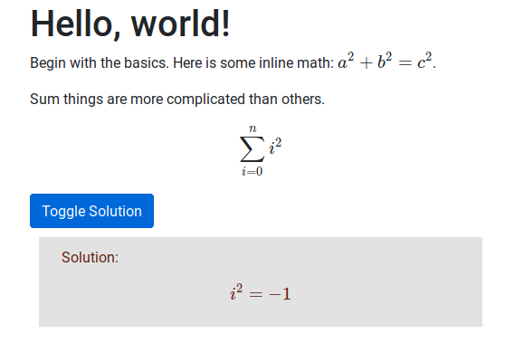

# MathJax Quickstart

There are many occasions where you might want to type up and share
some maths. While good old-fashioned pen and paper may be good enough
to share with a nearby friend/instructor, web browers are a now
ubiquitous feature of modern, 21st century living. Why not bring more
math to the browser?

In this tutorial, I will show you how to display nice looking math on
web pages that should look decent on any modern browser: desktop,
mobile, etc.

We will use [TeX](https://en.wikipedia.org/wiki/TeX) for input and
[HTML](https://developer.mozilla.org/en-US/docs/Web/HTML)/
[CSS](https://developer.mozilla.org/en-US/docs/Web/CSS) as output to
produce a static web page with a button to show/hide solution(s). 



There are many places where you can host (static) content like the web
page we will make in this tutorial for free, including Github. The
final product of this tutorial is served from [Github
pages](https://haksayng.github.io/mathjax-quickstart/).

## Prerequisites

This tutorial presumes no knowledge in web development specifically,
but presumes you know how to do things like create/remove/modify
files. If you have prior experience with HTML, CSS, a JavaScript, that
will help but such knowledge is not required to follow this tutorial.

In order to type math, you should become familiar with TeX. To get
started, I suggest playing around with a tool like this [Tex equation
editor](http://atomurl.net/math/).

TeX is commonly used for typesetting print-ready documents. Here, it is only
necessary to be familiar with those aspects of TeX that are used to specify
*mathematical content*.

## Setting things up

Create a new root directory for your webpage. For example, you might
make a folder called "homework_01" to house your first assignment in a
mathematics course.

### Bootstrap

Next, save the [Bootstrap 4](https://getbootstrap.com/docs/4.0/getting-started/introduction/) starter template as `index.html`. That content (as of Dec. 17, 2018) is copy-pasta'd below:

```html
<!doctype html>
<html lang="en">
  <head>
    <!-- Required meta tags -->
    <meta charset="utf-8">
    <meta name="viewport" content="width=device-width, initial-scale=1, shrink-to-fit=no">

    <!-- Bootstrap CSS -->
    <link rel="stylesheet" href="https://maxcdn.bootstrapcdn.com/bootstrap/4.0.0/css/bootstrap.min.css" integrity="sha384-Gn5384xqQ1aoWXA+058RXPxPg6fy4IWvTNh0E263XmFcJlSAwiGgFAW/dAiS6JXm" crossorigin="anonymous">

    <title>Hello, world!</title>
  </head>
  <body>
    <h1>Hello, world!</h1>

    <!-- Optional JavaScript -->
    <!-- jQuery first, then Popper.js, then Bootstrap JS -->
    <script src="https://code.jquery.com/jquery-3.2.1.slim.min.js" integrity="sha384-KJ3o2DKtIkvYIK3UENzmM7KCkRr/rE9/Qpg6aAZGJwFDMVNA/GpGFF93hXpG5KkN" crossorigin="anonymous"></script>
    <script src="https://cdnjs.cloudflare.com/ajax/libs/popper.js/1.12.9/umd/popper.min.js" integrity="sha384-ApNbgh9B+Y1QKtv3Rn7W3mgPxhU9K/ScQsAP7hUibX39j7fakFPskvXusvfa0b4Q" crossorigin="anonymous"></script>
    <script src="https://maxcdn.bootstrapcdn.com/bootstrap/4.0.0/js/bootstrap.min.js" integrity="sha384-JZR6Spejh4U02d8jOt6vLEHfe/JQGiRRSQQxSfFWpi1MquVdAyjUar5+76PVCmYl" crossorigin="anonymous"></script>
  </body>
</html>
```

Bootstrap will take care of many small, tedious problems of making a
website for us by providing sensible defaults for many things. More on
this later as we add some content.

Notice that there are various external links in the code
above. Bootstrap is provided via a [Content Delivery
Network](https://en.wikipedia.org/wiki/Content_delivery_network)
(CDN), as opposed to downloading/hosting that code ourselves.


### MathJax

Add MathJax, which will allow us to type TeX into HTML documents, by
copy/pasting the following line into the `<head>` of `index.html`. In
this repository, I have put it right before the closing tag, `</head>`.


```html
<script type="text/javascript" async
  src="https://cdnjs.cloudflare.com/ajax/libs/mathjax/2.7.5/MathJax.js?config=TeX-MML-AM_CHTML">
</script>
```

Like Bootstrap 4 above, we get MathJax via a CDN. 
Directly preceding the code we just added, copy-pasta this:

```html
<script type="text/x-mathjax-config">
MathJax.Hub.Config({
  tex2jax: {inlineMath: [['$','$'], ['\\(','\\)']]}
});
</script>
```

This script configures how we distinguish blocks of TeX from normal HTML text. 

## Adding some content

Find the line that says `<h1>Hello, world!</h1>`. Remove that line and
add the following text after `<body>`.

```html
<div class="container">
	<div class="row">
		<div class="col-md-12">
			<h1>Hello, world!</h1>
		</div>
	</div>
	<div class="row">
		<div class="col-md-12">
			<p>Begin with the basics. Here is some inline math:
			$ a^2 + b^2 = c^2$.</p>
			
			<p>Sum things are more complicated than others.</p>

			$$
			\sum_{i=0}^n i^2
			$$
		</div>
	</div>
</div>
```

What's going on here? First, look at the math we input here. Inline
math is marked off by single `$` signs. More complex expressions that
get their own line appear between `$$`'s.

All of this is housed in `<div>` elements, which are used to specify how
content is arranged on our page. Here, we have two rows which have one
column each. We are making use of Bootstrap's [Grid
System](https://getbootstrap.com/docs/4.0/layout/grid/).

While it takes some more lines of HTML to add Bootstrap's grid system,
doing so will ensure our web page displays nicely on various devices,
including smartphones, by making use of Bootstrap's default settings.

### Different styled solution box

Let's add a way to represent solutions differently from the rest of
our text using some CSS and JavaScript.  Following the second `</div>`
end tag after the sum equation, add the following code.

Here, we make another row and another column that belongs to it.

```html
<div class="row solution">
	<div class="col-md-12">
	<p>Solution:</p>
	
		$$
		  i^2 = -1
		$$
		
	</div>
</div>
```

Notice that after `row`, we added the term `solution`. This means that
our `<div>`, in addition to belonging to the class `row`, also belongs to
the class `solution` (which we will soon define).

In your root directory, make a file called `index.css`. To that file, add and save the following code:

```css
.solution {
    color: red;
}
```

To make the CSS file actually influence our document, we are going to
need to link our stylesheet. Return to the `<head>` of `index.html`
and added the following line after `<link rel="stylesheet" href="https://maxcdn...">`.

```html
<link rel="stylesheet" href="index.css">
```

Here, we *link* our CSS file (with *relation*=stylesheet) to our
current document.

Open `index.html` file in your browser. You will see that the solution
section is colored red. You can further edit `index.css` to change how
the text there will display. Here, I changed our colors a bit and
modified a couple of new attributes, **background** which is the
background color and padding, which can be adjusted to give our conent
more "elbow room".

```css
.solution {
    background: #e2e2e2;
    color: #5f2013;
    margin: 10px;
    padding: 10px;
}
```

### Making our solution hideable

Create a new file called `index.js`. Add the following line before the body
closing tag (`</body>`):

```html
<script src="index.js"></script>
```

Similarly to how we linked our own CSS file earlier in this tutorial,
here we include our own JavaScript file.

Now, let's add a button. Add the following line right after the full-width
equation, which is surrounded by `$$`'s.

```html
<button type="button" class="btn btn-primary">Toggle Solution</button>
```

This button doesn't do anything yet, but if you refresh `index.html`
in your browser, you should be able to see a new button appear. To
make this button do something, we have to associate it with some
function.

Let's modify the line we just added by making it uniquely identifiable
(by adding an 'id' attibute) and associating it with a function (by
adding an 'onclick' attribute).

```html
<button 
	type="button"
	class="btn btn-primary"
	onclick=toggleSolution()
>
	Toggle Solution
</button>
```

I broke this up into multiple lines here, but you can leave it all on
one line if you like that better.

In `index.js` we will write a function that shows/hides anything with the
class "solution". Open up that file now and add the following code:

```javascript
solutions = document.getElementsByClassName("solution")

isShowing = true; // True by default

function toggleSolution() {
    var i;
    for (i = 0; i < solutions.length; i++) {
	solutions[i].style.display = isShowing==true ? "none" : "block";
    }
    isShowing = !isShowing // Toggle true/false
}
```

This script toggles the visibility of all elements in our HTML
document of class 'solution'. The script is activated whenever we click
the button we just made.


## Final thoughts

**HTML** is used to specify the *content* of a webpage. **CSS** is
used to describe how that content is displayed. **JavaScript** can be
used to define page behavior as well as add/remove/manipulate HTML.

Here, we mix **TeX** with HTML to specify math content. This isn't
"built-in" to HTML by default, so we recruit the help of MathJax.

This tutorial didn't go too in depth to any one topic. Rather, it
showed how various technologies might be assembled to produce a useful
result. Hopefully it has offered you a useful starting point for more
sophisticated projects or has given you an idea of what you want to
learn about next.


## Other Options

In this tutorial, we wrote some math equations using HTML, CSS, and
JavaScript. These technologies are great because they are available
nearly everywhere.

Some other places to write math easily using TeX are:

- [RStudio](https://www.rstudio.com/)'s RMarkdown notebooks
- [Jupyter Notebook](https://jupyter.org/) (works well with Python)
